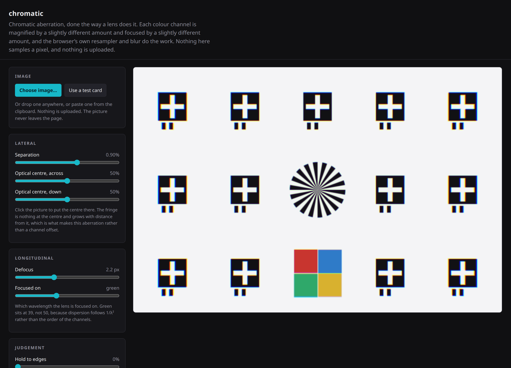

# chromatic

Chromatic aberration in the browser, done the way a lens does it.

**[Try it](https://tokyodaninjapan.github.io/chromatic/)**

[](https://tokyodaninjapan.github.io/chromatic/)

Or open `index.html` from a clone. There is no build, no server and no dependencies. Double-clicking the file works,
which is why this is a classic script rather than a module. Drop in an image, paste one, or use the test card. Nothing
is uploaded. The picture never leaves the page.

## What it actually does

Nothing here samples a pixel. The picture is drawn three times at three slightly different scales, one per colour
channel, and the browser's own resampler does the work. Each channel is then blurred by a different amount with the
platform's blur. The three are stripped to one channel each and added back together.

Two facts about the aberration do all of it, and both are the reason this needs no per-pixel code:

- **Lateral displacement is proportional to radius.** A wavelength that focuses at a larger magnification lands further
  out, and how much further is proportional to how far out it already was. That is exactly what a scale about the
  optical centre does. A scale is therefore not an approximation of lateral aberration. It is a statement of it.
- **Dispersion follows 1/λ², not the channel order.** Green does not sit halfway between red and blue. Taking 620, 540
  and 460 nm for the three channels, Cauchy's relation puts green at 0.39 of the way from red to blue. Every
  displacement and every blur here is interpolated on that axis.

## The version to argue with

"Chromatic aberration" is also used for shifting the red and blue channels sideways by a few pixels. That is a channel
offset, and it is not this. The difference is not subtle once you look for it:

|                  | Channel offset             | Real aberration                          |
| ---------------- | -------------------------- | ---------------------------------------- |
| At the centre    | Same fringe as at the edge | None at all                              |
| Across the frame | Uniform, and in one axis   | Radial, and grows with distance          |
| Green            | Usually left alone         | Moves, 0.39 of the way from red to blue  |
| Flat areas       | Fringe at every edge alike | Only edges change, and only near the rim |

Put the optical centre in a corner in the demo and the whole frame becomes a gradient of fringing, which a channel
offset cannot produce at all.

## Two aberrations, not one

They are worth separating, because they behave differently and the demo shows both:

- **Lateral** comes from magnification varying with wavelength. It is zero at the optical centre and grows with radius.
  This is the red and cyan edge fringing you see in the corners of a wide-angle photograph.
- **Longitudinal** comes from focal length varying with wavelength. At any one focus setting, some wavelengths are
  simply out of focus. It is **uniform across the frame**, and it is what makes the effect read as glass rather than as
  a printing error.

Set the separation to zero and raise the defocus in the demo. The blur appears everywhere at once, including at the
centre where the lateral fringing is nothing. That is the distinction, in one dial.

## Why there is no edge detection

There is none, and none is needed. Displacing a flat area by half a pixel returns the same flat area. The fringes appear
on edges because an edge is the only place where a small displacement changes anything. Turn on **Show the difference**
in the demo and everything flat goes black.

The **Hold to edges** dial is therefore not what it appears to be. The lateral fringing is already confined to edges by
the physics. What the dial actually removes is the _defocus_ in flat areas, which is a stylistic choice rather than a
physical one — a real lens defocuses the whole frame, flat or not. It is here because the look is useful, and it is
labelled honestly rather than sold as realism.

It also has a limit worth knowing. The dial mixes two copies of the picture that are displaced by different amounts, and
on detail finer than the fringe itself those two copies interfere and print a faint speckle. The mask is driven hard
towards fully on or fully off to keep that rare, but a resolution chart at a large separation will still show it.
Shortening the mask instead would cut the outer half of every fringe off, which is worse. Turn the dial down, or off, on
very fine subjects.

## What must never be done

- **Never scale a channel below 1.** A channel smaller than the frame uncovers the edge, and there is nothing behind it.
  Scale every channel up instead, so the smallest is exactly 1. The whole frame is then magnified by a few tenths of a
  per cent, which is a zoom, and a zoom is not an aberration.
- **Never blur without extending the frame first.** A blur samples outside what it is blurring, and outside the frame
  there is nothing, so the blur pulls in transparency and prints a dark border. `channel` lays a magnified copy down
  first, so what the blur finds out there is the picture continued. The padding is three times the blur radius, where a
  Gaussian has nothing left worth sampling.
- **Never space the channels evenly.** Green at 0.5 rather than 0.39 is the single most common way to make this look
  painted on.

## Using chromatic.js directly

`chromatic.js` sets `window.Chromatic` and depends on nothing. It is synchronous, because every step is a canvas
operation.

```js
const result = Chromatic.aberrate(canvas, {
  lateral: 0.004, // difference in magnification between red and blue
  cx: 0.5, // optical centre across, as a fraction of the frame
  cy: 0.5, // and down
  focus: 0.39, // which wavelength is sharp. 0 red, 0.39 green, 1 blue
  defocus: 0, // blur in pixels at the far end of that axis
  edges: 0, // hold the effect to edges, 0 to 1
  diff: false, // show what changed rather than the result
});

ctx.drawImage(result.canvas, 0, 0);
```

It returns a report rather than a picture alone, so you can see what happened:
`{ ok, canvas, scales, blurs, spread, pad, ms, filter }`. `spread` is how far red and blue are pulled apart at the
furthest corner, in pixels, which is the number a photographer would recognise. `filter` says whether the platform
accepted `ctx.filter`.

**The returned canvas is pooled.** It is overwritten by the next call, so draw it before calling again. Every canvas in
here is reused between calls, so an animated effect allocates nothing per frame.

**Feed it the original every time.** Aberrating your own output compounds, exactly as re-encoding a JPEG does. The demo
keeps an untouched source canvas for this reason.

### Where the platform can let you down

`ctx.filter` reached Safari only in version 17. Without it there is no defocus and no edge mask, but the lateral
aberration still works, because that is only a scale. `Chromatic.supports()` reports it, and the demo disables the two
dials that need it rather than failing quietly.

### On animating it

Unlike a datamosh, this effect is bounded and monotonic. Nothing here can swing the frame between near-black and
near-white, so animation needs no brightness guard, only the reduced-motion preference. With `prefers-reduced-motion`
set, the demo does not animate at all.

## Development

The shipped code has no dependencies. Prettier is the only development tool, and it keeps the formatting consistent:

```sh
npm install
npm run format   # rewrite the files
npm run check    # check them, as CI does
```

## Licence

MIT. See [LICENSE](LICENSE).
